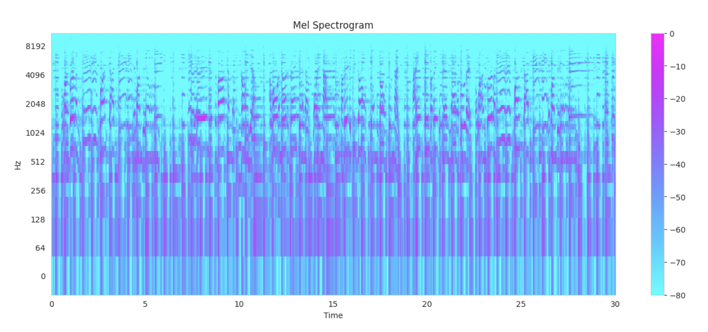
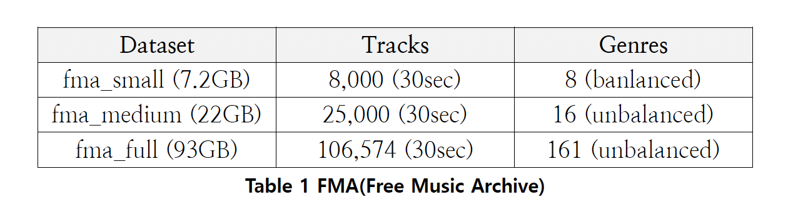
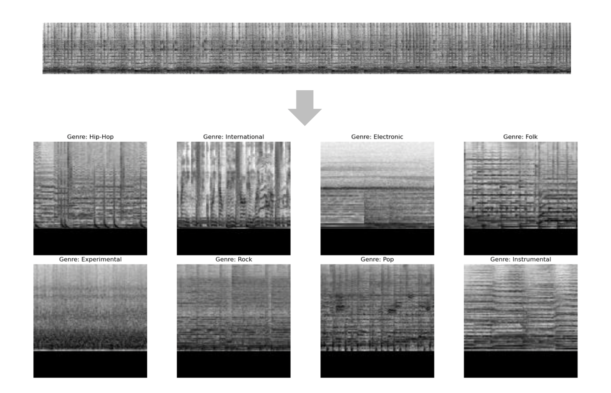
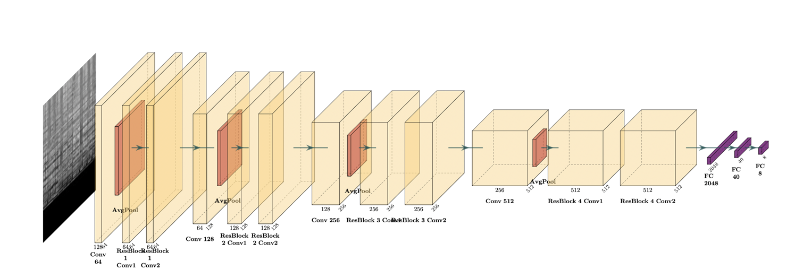
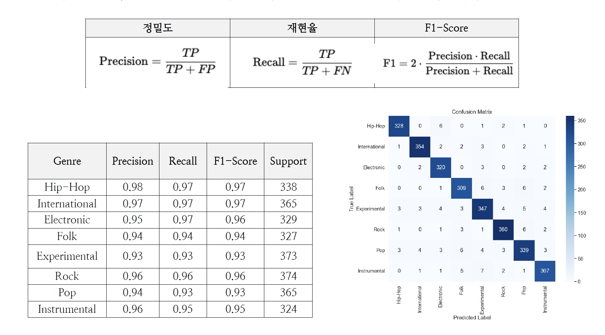
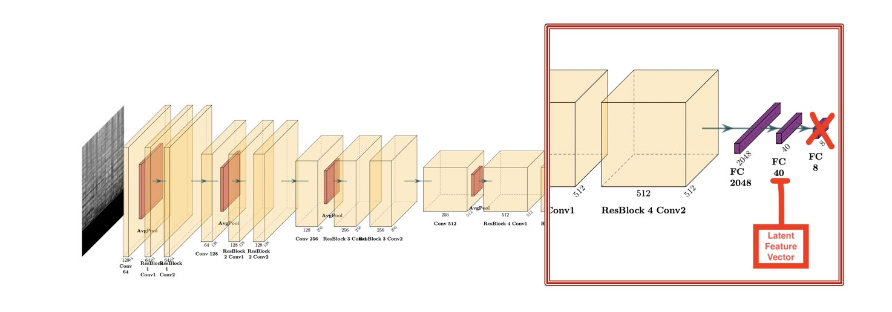
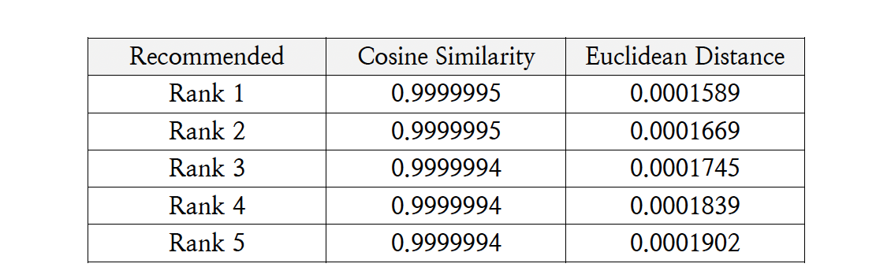
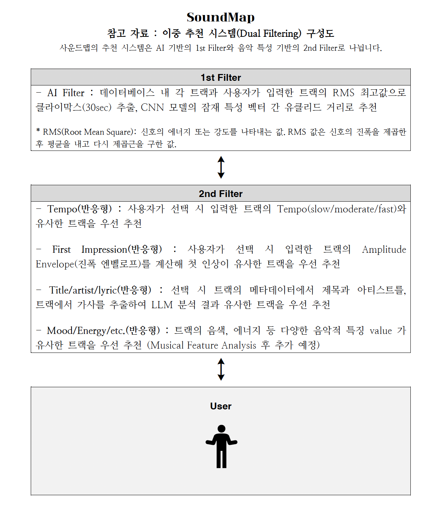

# Mel Spectrogram과 CNN 기반 장르 분류 모델을 활용한 음악 추천 시스템

### NIPA-Google ML 부트캠프 협력 실무 프로젝트 과정 (3기)
Team **SoundMap** - Jeeho Lim

## 요약
전통적인 음악 추천 시스템은 **협업 필터링**에 의존하지만, 이는 콜드 스타트 문제와 신규 혹은 희소한 음악에 대한 맞춤화 부족 문제를 자주 겪습니다. **Mel Spectrogram**과 **합성곱 신경망**을 결합한 **콘텐츠 기반** 접근 방식은 이러한 문제를 해결할 수 있는 유망한 대안입니다. 본 프로젝트에서는 **fma_small** 데이터셋을 사용해 CNN 기반 장르 분류 모델을 제안하고, 특징을 추출하여 **유클리드 거리**를 기반으로 한 추천 시스템을 구축했습니다. 제안된 모델은 높은 신뢰성의 분류 성능을 보여주며, 음악 트랙의 잠재적 특징을 추출 및 비교하여 일관성 있는 추천을 제공합니다. 또한, 이 접근 방식의 장점과 향후 더 큰 데이터셋과 고급 아키텍처를 활용한 개선 방안을 논의합니다.

## 1. 서론
### 1.1 협업 필터링의 한계
- **콜드 스타트 문제**: 새로운 사용자나 신규 트랙에 대한 추천이 어려움.
- **새로움의 부족**: 자주 재생되거나 인기 있는 곡만 반복적으로 추천하는 문제.

### 1.2 콘텐츠 기반 추천의 장점
- 사용자 상호작용 데이터 없이도 새로운 음악을 발견하고 맞춤형 음악을 제공할 수 있음.
- 오디오 특성에 따라 음악을 분석하고 그룹화할 수 있음.

### 1.3 Mel Spectrogram과 CNN의 중요성
Mel Spectrogram은 인간의 청각 지각과 일치하는 특징을 제공하여 유용하며, 이를 CNN과 결합하면 오디오 데이터에서 계층적 패턴을 효율적이고 정확하게 추출할 수 있습니다.

## 2. 데이터셋 및 전처리
### 2.1 데이터 선정 / 모델 선정 과정
- **GTZAN Dataset(1,000 tracks, 8 balanced genre)**: [GTZAN Music Genre Dataset](https://www.kaggle.com/datasets/andradaolteanu/gtzan-dataset-music-genre-classification))
- **FMA Small Dataset(8,000 tracks, 10 balanced genre)**: [FMA: A Dataset For Music Analysis](https://github.com/mdeff/fma)

| Step | Dataset | Feature Extraction | Model | Accuracy | Notes |
|------|---------|--------------------|-------|----------|-------|
| 1    | GTZAN (1000 songs) | 20 feature values | DNN | 93.5% | High accuracy, but too many features make explainable recommendations difficult. |
| 2    | GTZAN (1000 songs) | MFCCs, Data Augmentation | CNN | 81.1% | Decided to increase dataset size for further improvement. |
| 3    | FMA (8000 songs) | MFCCs | CNN | 58.9% | Unable to capture complex patterns in contemporary music. |
| 4    | FMA (8000 songs) | Mel Spectrogram (gray-scale), 128x128 slices | CNN | 95.3% | Final model selected; captures diverse patterns despite complex architecture. |
### 2.2 데이터 전처리

- **데이터셋**: **fma_small**을 사용하여 8개 장르, 8,000개의 트랙으로 구성.
- **전처리 과정**:
  - **리샘플링**: 모든 오디오 파일을 22,050 Hz로 리샘플링.
  - **세분화**: 30초 클립으로 분할.
  - **Mel Spectrogram 변환**: 128개의 Mel 밴드를 사용하여 변환하고 데시벨 스케일로 시각화.
  - **정규화**: 값 범위를 0과 1 사이로 조정하여 학습 안정성을 확보.

## 3. 모델 아키텍처 및 학습 과정
### 3.1 장르 분류를 위한 CNN 아키텍처

- **컨볼루션 및 풀링 블록**: 4개의 블록으로 구성되며 필터 수는 64에서 512로 증가.
- **ResBlock**: 각 블록 사이에 ResBlock을 추가하여 그래디언트 소실 방지 및 특징 추출 능력 향상.
- **완전 연결 레이어**: Adaptive Average Pooling 이후, Flatten과 두 개의 완전 연결 레이어를 통해 최종 8차원 출력으로 분류.

### 3.2 하이퍼파라미터 및 학습
- **손실 함수**: 교차 엔트로피 손실 함수 사용.
- **옵티마이저**: 초기 학습률 0.001의 Adam 옵티마이저 사용, 에포크에 따라 학습률 조정. 일정 에포크마다 학습률을 10배 감소.
- **배치 사이즈**: 32.
- **에포크**: 50 에포크, 검증 손실을 기준으로 조기 종료(Early Stopping).

## 4. 성능 평가

- **혼동 행렬**: Test Set에서 **95.31% 정확도**를 달성, 대부분의 장르에서 높은 정확도.
- **정밀도, 재현율, F1-Score**: 각 장르에 대해 높은 지표 확인.

## 5. 시스템 설계
### 5.1 잠재 특성 벡터 추출
모델의 최종 출력 레이어를 제거하고 40차원의 벡터를 출력하여 주요 특징을 추출, 유사성 계산에 활용.

### 5.2 유사도 계산 방법
- **코사인 유사도**: 두 벡터 간의 각도를 측정:
$$\text{cosine similarity} = \frac{A \cdot B}{||A|| \cdot ||B||}$$
- **유클리드 거리**: 벡터 간의 직선 거리를 측정:
$$d(A, B) = \sqrt{\sum_{i=1}^{n} (A_i - B_i)^2}$$

유클리드 거리는 벡터의 크기와 방향을 모두 반영하여, 더 명확한 수치적 차이를 제공.

## 6. 향후 개선 방안
- **추가적인 음성 분석 및 특징 정의**: 리듬, 템포, 음색 등을 '음악적 특징'으로 정의하여 추천의 설명력을 높일 예정.
- **더 큰 데이터셋 사용**: fma_small을 넘어 더 큰 데이터셋을 활용하여 모델 성능을 향상.
- **고급 아키텍처 탐색**: **Vision Transformers**와 같은 고급 아키텍처 탐구.
- **개인화 및 적응형 추천**: 사용자 피드백을 통합하여 맞춤형 추천 제공.

## 7. 결론
SoundMap 팀은 Mel Spectrogram과 CNN을 활용한 콘텐츠 기반 음악 추천 시스템을 제시하였으며, 제안된 시스템은 유클리드 거리 기반으로 일관성 있고 직관적인 추천을 제공합니다. 협업 필터링의 한계를 보완하며, 향후 연구를 통해 더 큰 데이터셋과 고급 아키텍처를 사용해 성능을 향상할 예정입니다.

**키워드**: 음악 추천, 콘텐츠 기반, Mel Spectrogram, CNN
